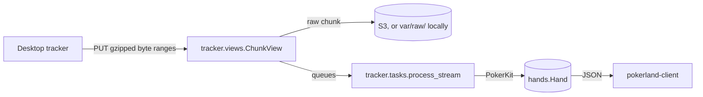

<h1 align="center">Pokerland API</h1>

<p align="center">
  <a href="#quick-start"><strong>Quick start</strong></a> •
  <a href="#usage"><strong>Usage</strong></a> •
  <a href="#endpoints"><strong>Endpoints</strong></a> •
  <a href="#how-it-works"><strong>How it works</strong></a> •
  <a href="#development"><strong>Development</strong></a> •
  <a href="#deploying"><strong>Deploying</strong></a> •
  <a href="https://github.com/jwc20/pokerland-trackers/blob/main/protocol/PROTOCOL.md"><strong>Upload protocol</strong></a>
</p>

<p align="center">
  
  
  
  
  
  <a href="LICENSE"></a>
</p>

## About

pokerland-api is the Django REST API between the trackers and the web app. It:

- **Takes hand-history files as PokerStars writes them.** Each file is a stream the trackers upload in gzipped byte
  ranges. The server remembers how much of each stream it has stored, so a tracker that restarts, loses its
  connection or even its local state resumes where it left off instead of uploading the file again.
- **Reads every hand with PokerKit.** The PokerStars text becomes the hand in [PHH](https://phh.readthedocs.io)
  notation, which PokerKit's rules engine plays through. Every post, deal, bet, raise, showdown and pot the web
  app's replay steps through is one the rules allow.
- **Serves the web app.** Sign-in with JWT cookies, the hand history, replays, and the home page's daily results,
  streaks and tags, all described by an OpenAPI schema that the web app generates its API client from.

### What it reads

|                |                                                                                                     |
| -------------- | --------------------------------------------------------------------------------------------------- |
| **Site**       | PokerStars hand histories, as the PokerStars client saves them                                      |
| **Games**      | No-limit hold'em and pot-limit Omaha                                                                |
| **Formats**    | Cash games, Zoom and tournaments, with play money or real money                                     |
| **Money**      | Real-money amounts in cents with their currency (USD, EUR, GBP, INR, ...); chips otherwise          |
| **Situations** | Antes, a returning player's dead small blind, side pots, split pots and the rake                    |
| **Skipped**    | Other games and hands run twice: logged, and counted in the stream's `parser_state["hands_failed"]` |

## Quick start

You need Python 3.14+ and [uv](https://docs.astral.sh/uv/). The API uses SQLite locally unless you run PostgreSQL, as
dev and prod do, in Docker ([below](#local-postgresql)).

```bash
git clone https://github.com/jwc20/pokerland-api.git
cd pokerland-api
cp .env.example .env               # then set DJANGO_SECRET_KEY, below
uv run python manage.py migrate
uv run python manage.py runserver  # http://localhost:8000
```

Generate a secret key for `.env` with:

```bash
uv run python -c "from django.core.management.utils import get_random_secret_key; print(get_random_secret_key())"
```

The Swagger UI at <http://localhost:8000/api/docs/> lists every endpoint (it isn't served in prod).
[pokerland-client](https://github.com/jwc20/pokerland-client)'s dev server talks to this address out of the box. To
point a tracker at your local API, run `pokerland-tracker login --api http://localhost:8000`.

## Endpoints

| Endpoint                                                              | Signed in with | Returns                                                                                                                                             |
| --------------------------------------------------------------------- | -------------- | --------------------------------------------------------------------------------------------------------------------------------------------------- |
| `POST /api/auth/registration/`, `login/`, `logout/`, `token/refresh/` | —              | [dj-rest-auth](https://dj-rest-auth.readthedocs.io), with the JWTs in httpOnly cookies. Registering signs you in.                                   |
| `GET /api/auth/user/`                                                 | cookies        | The signed-in user                                                                                                                                  |
| `GET /api/users/me/client-token/`                                     | cookies        | The token a tracker signs in with (never cached)                                                                                                    |
| `GET /api/hands/`                                                     | cookies        | The hands, newest first, 50 per cursor page. Narrow it with `?tag=` (keys from `tags/`, repeatable), `?since=`/`?until=` or `?date=` with `&tz=`, `?stat=` (the hero's chances at a statistic, with `&did=true` or `false`), `?result=`, `?review=to_review` or `reviewed`, `?note_tag=` (one of the user's tags), `?leak=` (the hands that broke a preflop discipline check) and `?session=`; sort it with `?sort=oldest`, `biggest_win` or `biggest_loss` (in big blinds); set `?page_size=` up to 50. Each hand has the hero's all-in equity, if the money went in before the river. |
| `GET /api/hands/<id>/`                                                | cookies        | One hand: its seats, events and board, the hand in PHH notation, and the hero's all-in equity and expected net                                    |
| `GET, POST /api/hands/<id>/notes/`, `DELETE /api/hands/<id>/notes/<note_id>/` | cookies | What the user wrote on a hand: a note on a street or the whole hand, tags, the review state, and why they made each bet or raise. A `POST` adds a note or changes the one it takes the place of |
| `GET /api/hands/days/?tz=<IANA zone>`                                 | cookies        | Each day's hands, result in big blinds and sessions in that time zone, with the current and best streak                                           |
| `GET /api/hands/tags/`                                                | cookies        | Hands counted by position, game, cash-game stakes and format, with won, lost and net big blinds                                                     |
| `GET /api/review/`                                                    | cookies        | The review queue: how many hands are flagged to review and reviewed, the latest flagged, and the user's tags                                       |
| `GET /api/stats/`                                                     | cookies        | The hero's statistics (VPIP, PFR, 3-bet, c-bet, ...) as did ÷ could with 95% Wilson intervals, the rake paid and the net before it, and the net adjusted for all-in equity; for all hands or by `?group_by=position`, `month` or `stakes`; narrow with `?tag=` (repeatable), `?since=` and `?until=` |
| `GET /api/stats/purposes/`                                            | cookies        | The hero's bets and raises by the purpose the user gave them and by street: how often each took the pot at once, was called or was raised, its average size and the folds a bluff of that size needs |
| `GET /api/leaks/?group=preflop`                                       | cookies        | The preflop discipline checks: open-limps, open and 3-bet sizes, short stacks raising small, premiums limped, short buy-ins and hands per orbit, as times broken ÷ chances with 95% ranges and a trend by month |
| `GET, PATCH /api/leaks/presets/`                                      | cookies        | The checks' thresholds: the course values, or the user's own; `null` puts one back                                                                  |
| `GET /api/sessions/`, `GET /api/sessions/<id>/`                       | cookies        | Sessions, the latest first: stretches of play with no gap of over half an hour, with their length, tables, result, all-in adjusted result and biggest pot |
| `GET /api/sessions/patterns/`                                         | cookies        | Results by hour into the session, time of day, day of the week and tables at once, each with the spread for a 95% range                         |
| `GET /api/practice/sets/today/?tz=`                                   | cookies        | Today's practice set, made the first time it is asked for: spots coming back for review, decisions from the user's own hands at least a day old and the arithmetic behind them, and generated spots. Answers stay on the server until a spot is answered |
| `POST /api/practice/sets/`, `GET /api/practice/sets/<id>/`            | cookies        | A set of one mode (`my_hands`, `generated` with a `skill`, `library`, `their_seat`, or `shared`: hands shared with the user's classes, anonymized), and any of the user's sets with the answers given so far |
| `POST /api/practice/attempts/`                                        | cookies        | Answers a spot: the grade (never by the card that came), the answer and how it was worked out. A miss comes back the next day                      |
| `POST /api/practice/reviews/`                                         | cookies        | "Again later": the spot comes back in Leitner boxes, a day away at first and further after each good answer                                         |
| `GET /api/practice/profile/?tz=`                                      | cookies        | Accuracy by skill with 95% Wilson ranges (a rule of thumb counts half, a reflection not at all), the practice streak and the reviews due             |
| `GET, POST /api/practice/playbooks/`                                  | cookies        | The playbooks the user can play by: the house presets, their own and their classes', each at its latest version; and a copy of one of them, theirs to edit |
| `GET, PUT, DELETE /api/practice/playbooks/<id>/`                      | cookies        | One playbook's rule cards and the user's coach stage in each rule family; for their own, its next version (every card checked, the classes it's assigned to moving to it), or putting it away |
| `GET /api/practice/playbooks/vocabulary/`                             | cookies        | What a card can say: the tests the rule engine runs, and the families, scopes, reads, actions and exceptions |
| `GET /api/practice/hands/by-the-book/?playbook=`                      | cookies        | How often the user's last 1,000 hands at least a day old kept each rule, with 95% ranges; with `&rule=`, the decisions it applied to                 |
| `GET, POST /api/practice/matches/`                                    | cookies        | The user's coached matches, and a new one: heads-up against a bot with a hidden style and leak (`opponent`), with the coach at the user's stage or pinned to one (`coach`) |
| `GET /api/practice/matches/<id>/`; `POST` its `act/`, `intent/`, `ask/`, `next/`, `resign/`, `departure/` and `reads/` | cookies | A match as the player sees it, the coach saying as much as the stage allows; and each step in it: a move, a stage-2 intent, asking the coach, the next hand, ending the match, why a rule was left, a note on the read card |
| `GET /api/practice/matches/<id>/debrief/`                             | cookies        | Once the match is over: the debrief, with the bot's style and leak revealed                                                                         |
| `GET, POST /api/practice/tests/`; `GET` a test, its `next/`; `POST` its `answer/`, `end/`| cookies        | The aptitude test: adaptive spots across every skill, and the report with ratings and their ranges |
| `GET, POST /api/practice/tables/`; `GET` a table; `POST` its `act/`, `next/`| cookies        | Play it out: a table of two to nine against bots, from a deal or from one of the user's own decisions at least a day old |
| `GET, POST /api/leagues/`, `POST /api/leagues/join/`                  | cookies        | The user's classes, a new one (they own and coach it, and get an invite code), and joining one by its code |
| `GET, PATCH /api/leagues/<id>/`                                       | cookies        | A class: its playbooks and anonymized shared hands, and who's in it; a coach also sees the invite code and every member, and can rename it or make a new code |
| `PATCH, DELETE /api/leagues/<id>/me/`                                 | cookies        | Whether the user shows the coaches their progress (totals only, never hands); or leaving the class |
| `PATCH, DELETE /api/leagues/<id>/members/<id>/`                       | cookies        | For a coach: making someone a coach or a member, or taking them out of the class |
| `POST /api/leagues/<id>/assignments/`, `DELETE` one                   | cookies        | A coach assigns one of their playbooks; anyone shares one of their hands (an anonymized E2 share); whoever put it there, or a coach, withdraws it |
| `GET /api/leagues/<id>/progress/`, `GET` a member's                   | cookies        | For a coach: each sharing member's practice accuracy and playbook stages; one member's adds how their own hands kept each rule |
| `GET /api/tracker/status/`                                            | cookies        | What the user's trackers have uploaded: the last upload, files, hands, platforms and versions                                                       |
| `GET /api/tracker/me/`, `GET /api/tracker/config/`                    | client token   | The token's user, and the settings a tracker fetches at startup and every few hours                                                                 |
| `PUT /api/tracker/streams/<id>/`                                      | client token   | Registers a hand-history file, or tells a tracker how much of it the server has                                                                     |
| `PUT /api/tracker/streams/<id>/chunks/<start>/`                       | client token   | Stores the next gzipped byte range of a file and queues it for parsing                                                                              |

The endpoints marked "cookies" answer 401 without them. The tracker endpoints expect
`Authorization: Token <client token>`, and answer 426 to a tracker older than `TRACKER_MIN_CLIENT_VERSION`. The
access token lasts 15 minutes and the refresh token 7 days; refresh tokens rotate, and used ones are blacklisted.
The OpenAPI schema is at `/api/schema/` (not served in prod).

## How it works



### Kept results

Stats, leaks, the sizing and lines reports, session patterns, the history's tag counts and by the book read a user's
whole history, so their answers are kept in the database (`hands.results`, the `KeptResult` table) and served in one
query until something they read changes. Anything that changes it moves the user's `DataVersion` on, and the next
request works the answer out again:

- uploads and reparses (`hands.store.store_hands`) and `rebuild_sessions`;
- a hand saved on its own (the admin), a deleted stream, leak presets and reviews, and saved spots (`hands.signals`).

A deploy that changes the code in `hands`, `practice` or `tracker/parsing` starts afresh by itself: each answer is
kept with a fingerprint of that code. Two rules keep it exact:

- **Code that changes a user's data in another way calls `hands.results.changed(user_id)`** in the same transaction:
  deleting hands, say, or a bulk update. (A hand's deletion isn't watched by a signal: Django would then load every
  hand row, replays and all, to delete a stream or a user.)
- **A view that starts keeping its answer** must read nothing but the data above, or watch what else it reads. Notes
  aren't watched, since no kept answer reads them; `hands.tests_results` checks the kept views' filters for them.

`pokerlandapi.tests_queries` counts each list endpoint's queries before and after adding rows, so a query per row
fails the suite.

### Operations

- `zappa_settings.json` schedules `tracker.tasks.sweep_stale_streams` every five minutes. It re-queues the chunks
  whose async invocation was lost.
- `uv run python manage.py tracker_drain [--reparse [--all]] [stream ids]` parses waiting chunks synchronously, or
  re-parses streams from byte zero after a parser change.
- Raise `tracker.parsing.PARSER_VERSION` whenever the parser's output changes, and run
  `tracker_drain --reparse --all` after deploying it.
- To require a newer tracker, raise `TRACKER_MIN_CLIENT_VERSION`. Older trackers then get 426 and show "update
  required", and the Windows tracker updates itself.
- `uv run python manage.py practice_generate [--per-skill 50] [--skill push_fold]` fills the pool of generated
  practice spots that every user shares. A push-or-fold spot samples its equity, so run it after deploying rather
  than leave the spots to be made in a request.
- `uv run python manage.py rebuild_sessions [usernames]` builds the users' sessions afresh from their hands. Storing
  hands keeps them up to date; this is for hands stored before sessions were, or after changing the gap.
- `uv run python manage.py equity_benchmark` times the all-in equity the parser works out, by kind of all-in. Run it
  on Lambda (`zappa manage dev equity_benchmark`) to see what a reparse costs there.

## Configuration

Settings come from environment variables, which `pokerlandapi/settings.py` reads from `.env` locally. Every
variable is documented in [`.env.example`](.env.example).

| Variable                                                  | Purpose                                                                                                                                                                                                                                        |
| --------------------------------------------------------- | ---------------------------------------------------------------------------------------------------------------------------------------------------------------------------------------------------------------------------------------------- |
| `DJANGO_ENV`                                              | `local`, `dev` or `prod`. `DEBUG` is on only for `local`; on Lambda, `zappa_settings.json` sets it.                                                                                                                                            |
| `DJANGO_SECRET_KEY`                                       | One per environment.                                                                                                                                                                                                                           |
| `DJANGO_ALLOWED_HOSTS`                                    | Comma-separated hostnames.                                                                                                                                                                                                                     |
| `CORS_ALLOWED_ORIGINS`                                    | The web app origins allowed to call the API with cookies, e.g. `http://localhost:5173`.                                                                                                                                                        |
| `DB_NAME`, `DB_USER`, `DB_PASSWORD`, `DB_HOST`, `DB_PORT` | PostgreSQL. Leave `DB_NAME` empty locally to use `db.sqlite3`.                                                                                                                                                                                 |
| `TRACKER_MIN_CLIENT_VERSION`                              | Trackers below this version get 426 and must update. `0.0.0` also lets in unversioned dev builds.                                                                                                                                              |
| `TRACKER_RAW_BUCKET`                                      | A private S3 bucket for the raw chunks, required on Lambda; Zappa's default execution role can write to it. Left empty, chunks go under `var/raw/` (local only). Add a lifecycle rule that moves objects to a colder tier after about 60 days. |

## Development

```bash
uv run python manage.py test
```

The tests use Django's runner and DRF's test client, with SQLite unless `DB_NAME` is set (as `.env` sets it when
you use the local PostgreSQL below; run `DB_NAME= uv run python manage.py test` for SQLite). The parser tests read the
fixtures, and `pokerlandapi.tests.SchemaTests` runs `spectacular --validate --fail-on-warn`, so a schema warning fails
the suite. After changing an endpoint, regenerate pokerland-client's API client: run `npm run generate:api` there
while this server is running.

### Local PostgreSQL

SQLite is enough to get going, but dev and prod run PostgreSQL, and some queries behave differently on it. To develop
and test against PostgreSQL, start it in Docker with [`compose.yaml`](compose.yaml); the API still runs on your machine.

```bash
docker compose up -d --wait      # PostgreSQL on 127.0.0.1:5432, data kept in a Docker volume
```

Then set the database in `.env` as `.env.example` describes (`DB_NAME`, `DB_USER` and `DB_PASSWORD` to `pokerland`,
`DB_HOST` to `127.0.0.1`), and run `uv run python manage.py migrate`. The container takes its database, user, password
and port from the same variables. PostgreSQL only reads the first three when it creates its data, so after changing
them, recreate it with `docker compose down -v`. The tests create a `test_pokerland`
database next to it and drop it afterwards. `docker compose down` stops PostgreSQL and keeps the data;
`docker compose down -v` deletes it too.

```
pokerlandapi/   settings, root URLs, cookie JWT auth, registration, schema extensions
users/          the client tokens trackers sign in with
tracker/        uploads (streams, chunks, raw storage, async parsing) and the parser in tracker/parsing/, with
                all-in equity in tracker/parsing/equity.py
hands/          parsed hands, each player's facts, the user's notes and sessions, and the filters, stats and leak
                checks behind the web app
practice/       practice sets and their grading, the playbook's rules, and coached matches: PokerKit tables,
                bots with leaks, the coach and the read card
scripts/        deploy.py
```

## Deploying

```bash
uv run python scripts/deploy.py dev            # or prod
uv run python scripts/deploy.py dev --dry-run  # validate only, change nothing in AWS
```

Each run checks `zappa_settings.json` and `.env.<stage>` against `.env.example`, uploads the environment to the
stage's S3 `remote_env`, runs `zappa deploy` (plus `zappa certify` for a custom domain) or `zappa update`, and
migrates. See the script's docstring for the details.

| Stage  | Runs on                                                                                          | Notes                                                      |
| ------ | ------------------------------------------------------------------------------------------------ | ---------------------------------------------------------- |
| `dev`  | AWS Lambda in `ap-northeast-2`, behind API Gateway                                               | PostgreSQL, raw chunks in S3, the sweep every five minutes |
| `prod` | The same, at the custom domain the trackers' production builds use (`https://api.pokerland.app`) | Also kept warm                                             |

## Related projects

- [pokerland-client](https://github.com/jwc20/pokerland-client): the web app, in React and TypeScript on Cloudflare.
- [pokerland-trackers](https://github.com/jwc20/pokerland-trackers): the trackers for Windows and macOS, and the
  upload protocol they share.

## Support

Found a bug, or a hand that doesn't parse? [Open an issue](https://github.com/jwc20/pokerland-api/issues). The hand
history helps, if you can share it.

## License

[MIT](LICENSE)
