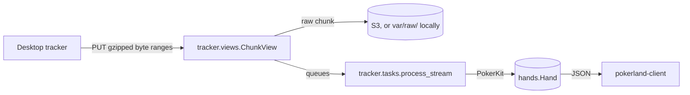

<h1 align="center">Pokerland API</h1>

<p align="center">
  <a href="#quick-start"><strong>Quick start</strong></a> •
  <a href="#usage"><strong>Usage</strong></a> •
  <a href="#endpoints"><strong>Endpoints</strong></a> •
  <a href="#how-it-works"><strong>How it works</strong></a> •
  <a href="#development"><strong>Development</strong></a> •
  <a href="#deploying"><strong>Deploying</strong></a> •
  <a href="https://github.com/jwc20/pokerland-trackers/blob/main/protocol/PROTOCOL.md"><strong>Upload protocol</strong></a>
</p>

<p align="center">
  
  
  
  
  
  <a href="LICENSE"></a>
</p>

## About

pokerland-api is the Django REST API between the trackers and the web app. It:

- **Takes hand-history files as PokerStars writes them.** Each file is a stream the trackers upload in gzipped byte
  ranges. The server remembers how much of each stream it has stored, so a tracker that restarts, loses its
  connection or even its local state resumes where it left off instead of uploading the file again.
- **Reads every hand with PokerKit.** The PokerStars text becomes the hand in [PHH](https://phh.readthedocs.io)
  notation, which PokerKit's rules engine plays through. Every post, deal, bet, raise, showdown and pot the web
  app's replay steps through is one the rules allow.
- **Serves the web app.** Sign-in with JWT cookies, the hand history, replays, and the home page's daily results,
  streaks and tags, all described by an OpenAPI schema that the web app generates its API client from.

### What it reads

|                |                                                                                                     |
| -------------- | --------------------------------------------------------------------------------------------------- |
| **Site**       | PokerStars hand histories, as the PokerStars client saves them                                      |
| **Games**      | No-limit hold'em and pot-limit Omaha                                                                |
| **Formats**    | Cash games, Zoom and tournaments, with play money or real money                                     |
| **Money**      | Real-money amounts in cents with their currency (USD, EUR, GBP, INR, ...); chips otherwise          |
| **Situations** | Antes, a returning player's dead small blind, side pots, split pots and the rake                    |
| **Skipped**    | Other games and hands run twice: logged, and counted in the stream's `parser_state["hands_failed"]` |

## Quick start

You need Python 3.14+ and [uv](https://docs.astral.sh/uv/). The API uses SQLite locally unless you run PostgreSQL, as
dev and prod do, in Docker ([below](#local-postgresql)).

```bash
git clone https://github.com/jwc20/pokerland-api.git
cd pokerland-api
cp .env.example .env               # then set DJANGO_SECRET_KEY, below
uv run python manage.py migrate
uv run python manage.py runserver  # http://localhost:8000
```

Generate a secret key for `.env` with:

```bash
uv run python -c "from django.core.management.utils import get_random_secret_key; print(get_random_secret_key())"
```

The Swagger UI at <http://localhost:8000/api/docs/> lists every endpoint (it isn't served in prod).
[pokerland-client](https://github.com/jwc20/pokerland-client)'s dev server talks to this address out of the box. To
point a tracker at your local API, run `pokerland-tracker login --api http://localhost:8000`.

## Endpoints

| Endpoint                                                              | Signed in with | Returns                                                                                                                                             |
| --------------------------------------------------------------------- | -------------- | --------------------------------------------------------------------------------------------------------------------------------------------------- |
| `POST /api/auth/registration/`, `login/`, `logout/`, `token/refresh/` | —              | [dj-rest-auth](https://dj-rest-auth.readthedocs.io), with the JWTs in httpOnly cookies. Registering signs you in.                                   |
| `GET /api/auth/user/`                                                 | cookies        | The signed-in user                                                                                                                                  |
| `GET /api/users/me/client-token/`                                     | cookies        | The token a tracker signs in with (never cached)                                                                                                    |
| `GET /api/hands/`                                                     | cookies        | The hands, newest first, 50 per cursor page. Narrow it with `?tag=` (a key from `tags/`) or `?date=YYYY-MM-DD&tz=`, and set `?page_size=` up to 50. |
| `GET /api/hands/<id>/`                                                | cookies        | One hand: its seats, events and board, and the hand in PHH notation                                                                                 |
| `GET /api/hands/days/?tz=<IANA zone>`                                 | cookies        | Each day's hands and result in big blinds in that time zone, with the current and best streak                                                       |
| `GET /api/hands/tags/`                                                | cookies        | Hands counted by position, game, cash-game stakes and format, with won, lost and net big blinds                                                     |
| `GET /api/tracker/status/`                                            | cookies        | What the user's trackers have uploaded: the last upload, files, hands, platforms and versions                                                       |
| `GET /api/tracker/me/`, `GET /api/tracker/config/`                    | client token   | The token's user, and the settings a tracker fetches at startup and every few hours                                                                 |
| `PUT /api/tracker/streams/<id>/`                                      | client token   | Registers a hand-history file, or tells a tracker how much of it the server has                                                                     |
| `PUT /api/tracker/streams/<id>/chunks/<start>/`                       | client token   | Stores the next gzipped byte range of a file and queues it for parsing                                                                              |

The endpoints marked "cookies" answer 401 without them. The tracker endpoints expect
`Authorization: Token <client token>`, and answer 426 to a tracker older than `TRACKER_MIN_CLIENT_VERSION`. The
access token lasts 15 minutes and the refresh token 7 days; refresh tokens rotate, and used ones are blacklisted.
The OpenAPI schema is at `/api/schema/` (not served in prod).

## How it works



### Operations

- `zappa_settings.json` schedules `tracker.tasks.sweep_stale_streams` every five minutes. It re-queues the chunks
  whose async invocation was lost.
- `uv run python manage.py tracker_drain [--reparse [--all]] [stream ids]` parses waiting chunks synchronously, or
  re-parses streams from byte zero after a parser change.
- Raise `tracker.parsing.PARSER_VERSION` whenever the parser's output changes, and run
  `tracker_drain --reparse --all` after deploying it.
- To require a newer tracker, raise `TRACKER_MIN_CLIENT_VERSION`. Older trackers then get 426 and show "update
  required", and the Windows tracker updates itself.

## Configuration

Settings come from environment variables, which `pokerlandapi/settings.py` reads from `.env` locally. Every
variable is documented in [`.env.example`](.env.example).

| Variable                                                  | Purpose                                                                                                                                                                                                                                        |
| --------------------------------------------------------- | ---------------------------------------------------------------------------------------------------------------------------------------------------------------------------------------------------------------------------------------------- |
| `DJANGO_ENV`                                              | `local`, `dev` or `prod`. `DEBUG` is on only for `local`; on Lambda, `zappa_settings.json` sets it.                                                                                                                                            |
| `DJANGO_SECRET_KEY`                                       | One per environment.                                                                                                                                                                                                                           |
| `DJANGO_ALLOWED_HOSTS`                                    | Comma-separated hostnames.                                                                                                                                                                                                                     |
| `CORS_ALLOWED_ORIGINS`                                    | The web app origins allowed to call the API with cookies, e.g. `http://localhost:5173`.                                                                                                                                                        |
| `DB_NAME`, `DB_USER`, `DB_PASSWORD`, `DB_HOST`, `DB_PORT` | PostgreSQL. Leave `DB_NAME` empty locally to use `db.sqlite3`.                                                                                                                                                                                 |
| `TRACKER_MIN_CLIENT_VERSION`                              | Trackers below this version get 426 and must update. `0.0.0` also lets in unversioned dev builds.                                                                                                                                              |
| `TRACKER_RAW_BUCKET`                                      | A private S3 bucket for the raw chunks, required on Lambda; Zappa's default execution role can write to it. Left empty, chunks go under `var/raw/` (local only). Add a lifecycle rule that moves objects to a colder tier after about 60 days. |

## Development

```bash
uv run python manage.py test
```

The tests use Django's runner and DRF's test client, with SQLite unless `DB_NAME` is set. The parser tests read the
fixtures, and `pokerlandapi.tests.SchemaTests` runs `spectacular --validate --fail-on-warn`, so a schema warning fails
the suite. After changing an endpoint, regenerate pokerland-client's API client: run `npm run generate:api` there
while this server is running.

### Local PostgreSQL

SQLite is enough to get going, but dev and prod run PostgreSQL, and some queries behave differently on it. To develop
and test against PostgreSQL, start it in Docker with [`compose.yaml`](compose.yaml); the API still runs on your machine.

```bash
docker compose up -d --wait      # PostgreSQL on 127.0.0.1:5432, data kept in a Docker volume
```

Then set the database in `.env` as `.env.example` describes (`DB_NAME`, `DB_USER` and `DB_PASSWORD` to `pokerland`,
`DB_HOST` to `127.0.0.1`), and run `uv run python manage.py migrate`. The container takes its database, user, password
and port from the same variables. PostgreSQL only reads the first three when it creates its data, so after changing
them, recreate it with `docker compose down -v`. The tests create a `test_pokerland`
database next to it and drop it afterwards. `docker compose down` stops PostgreSQL and keeps the data;
`docker compose down -v` deletes it too.

```
pokerlandapi/   settings, root URLs, cookie JWT auth, registration, schema extensions
users/          the client tokens trackers sign in with
tracker/        uploads (streams, chunks, raw storage, async parsing) and the parser in tracker/parsing/
hands/          parsed hands, and the filters and stats behind the web app's home page
scripts/        deploy.py
```

## Deploying

```bash
uv run python scripts/deploy.py dev            # or prod
uv run python scripts/deploy.py dev --dry-run  # validate only, change nothing in AWS
```

Each run checks `zappa_settings.json` and `.env.<stage>` against `.env.example`, uploads the environment to the
stage's S3 `remote_env`, runs `zappa deploy` (plus `zappa certify` for a custom domain) or `zappa update`, and
migrates. See the script's docstring for the details.

| Stage  | Runs on                                                                                          | Notes                                                      |
| ------ | ------------------------------------------------------------------------------------------------ | ---------------------------------------------------------- |
| `dev`  | AWS Lambda in `ap-northeast-2`, behind API Gateway                                               | PostgreSQL, raw chunks in S3, the sweep every five minutes |
| `prod` | The same, at the custom domain the trackers' production builds use (`https://api.pokerland.app`) | Also kept warm                                             |

## Related projects

- [pokerland-client](https://github.com/jwc20/pokerland-client): the web app, in React and TypeScript on Cloudflare.
- [pokerland-trackers](https://github.com/jwc20/pokerland-trackers): the trackers for Windows and macOS, and the
  upload protocol they share.

## Support

Found a bug, or a hand that doesn't parse? [Open an issue](https://github.com/jwc20/pokerland-api/issues). The hand
history helps, if you can share it.

## License

[MIT](LICENSE)
